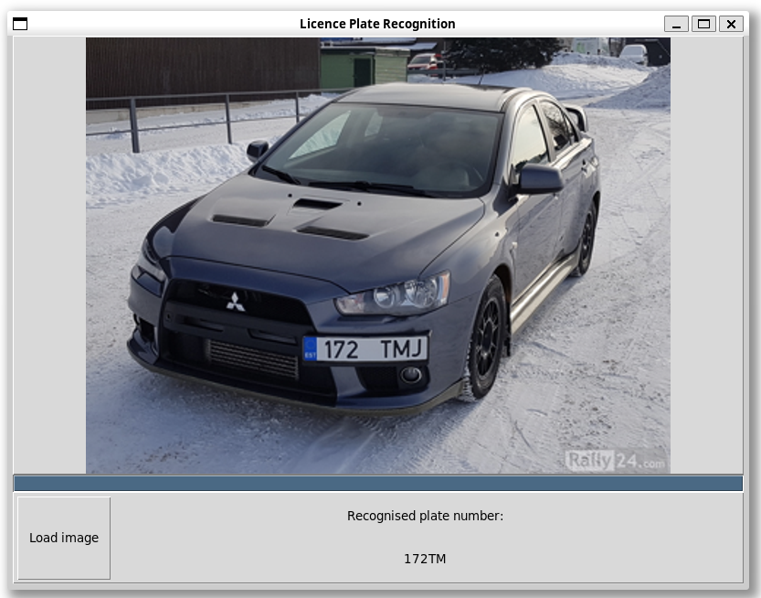

# License Plates Detecting App

This application is designed to process images and extract license plate as a text.

## App Functionalities

### Image Upload:
  - Users can upload an image by clicking on the designated "Load Image" button.
  - A file dialog will prompt the user to select an image file.
  - User can choose only .png files

### Image Processing with Visible Progress Bar:
  - In this step image is being processed. 
  - Processing steps, such as filtering or edge detection, are performed in the background. 
  - Progress bar is displayed at the bottom which shows progress with image processing using x method.

### Result Display at the Bottom:
  - The final result of the image processing is displayed at the bottom of the app.
  - If license plate number could not be found then there is displayed 'not found' message

### Application GUI:


## How to launch an application
Please follow this steps to run an app:
1. To run this application you need `python3`(and `pip` to easily install libraries) installed.  
If you do not have python3 installed yet please follow this: <a href="https://wiki.python.org/moin/BeginnersGuide/Download" target="_blank">installation instructions</a>
2. Ensure that you have all required libraries installed.  
You can install all of required libraries using `pip(pip3)`.
3. Run program with:
```
python3 AO_projekt.py
```
3. That's all!

## Required libraries:
1. **cv2: OpenCV** is used in for contour detection, image filtering and binarazing.  
About: <a href="https://opencv.org/releases/" target="_blank">documentation and installation instructions</a>

2. **numpy: Numerical Python** is used in our project for handling large arrays and its processing.  
About: <a href="https://numpy.org/" target="_blank">documentation and installation instructions</a>

3. **easyocr: EasyOCR** is used in our project for optical character recognition (detecting license plate numbers).  
About: <a href="https://pypi.org/project/easyocr/" target="_blank">documentation and installation instructions</a>

4. **tkinter: Tkinter** is used in our project to create the graphical user interface (GUI).  
About: <a href="https://docs.python.org/3/library/tkinter.html" target="_blank">documentation and installation instructions</a>
5. **PIL: Python Imaging Library (Pillow)** is used for image uploading and processing.  
About: <a href="https://pypi.org/project/pillow/" target="_blank">documentation and installation instructions</a>


## Extracting license plate number
**Initial note:** our first attempt was to train and use model with **pytesseract** library. Althought after spending a lot of time without any relevant result we have decided to take another approach: extracting license plate subimages from orginal photo using manual image analysis techniques and then detecting text using **easyocr**. 
To document our investigation, here are scrach files which were used initialy in our model training attempts: [plate_number_detection_initial_attempts](./docs/plate_number_detection_initial_attempts/)

### Current implementation
 1. User upload image and it is saved as Python Imaging Library Image then converted to grayscale
 2. Image is preprocessed one of 3 methods, which are called in order from most common case to the more specific.  
 For example: *if the license plate has been found after processing image with 1 method then program print result and methods 2, 3 would not be called. Otherwise, if license plate text couldn't been found then app try to process it with next method and then detect license plate number*.  
 Description of methods which are used to process image is available in the next point.
 3. Using OpenCV's contour detection objects are extracted from the image. 
 4. Objects are processed and saved to set of unique elements: only objects which are parents are preserved.  
 *Note: if we are looking for license plate then we are sure that each license plate constains child objects in the form of  characters.* 
 5. We are iterating over list of parents elements. If element has exactly 4 vertices then:
    - mask to crop the image is created
    - mask is applied to image and as a result we can save cropped image containing only possible license plate to file
 6. Images which passes filtering metioned in previous points are saved to [cropped_results](./cropped_results/) directory. 
 7. Iterating over each image saved in the previous point we are trying to detect license plate text. If license plate text is detected then program print it and stop processing further images.
 When program processed image using all 3 methods and didn't detect license plate number then message that license plate couldn't been found is displayed.

## Methods used for image transformation
As it was metioned in the previous point there are 3 methods which try to prepare image to be processed by text detecting algorithm.
1. Method 1(most commonly used) - it consist of 3 steps:
    - **bilateral filter:** it is non-linear, edge-preserving, and noise reducing smoothing filter. It particulary smooth image while preserving edges and as a effect removes noise from the photo.
    - **threshold using Otsu's method with tozero:** the image is converted to monochrome using threshold value got from Otsu's method and TOZERO technique.
    - **deterministic threshold:** when Otsu method fails the optimal threshold is found by increasing the threshold value by 50.
    - **adaptiveThreshold** image is converted to binary and inverted using filter which adjust thresholding to neighbourhood of the pixels
2. Method 2:
    - **bilateral filter:** it is non-linear, edge-preserving, and noise reducing smoothing filter. It particulary smooth image while preserving edges and as a effect removes noise from the photo.
    - **threshold using Otsu's method with tozero:** Utilizes Otsu's method to automatically determine an optimal threshold.
    - **Canny edge detection** applies the Canny edge detection algorithm to the filtered and thresholded image(threshold detected in previous step is used).
2. Method 3:
    - **bilateral filter:** it is non-linear, edge-preserving, and noise reducing smoothing filter. It particulary smooth image while preserving edges and as a effect removes noise from the photo.
    - **threshold using Otsu's method with tozero:** Utilizes Otsu's method to automatically determine an optimal threshold.
    - **Laplacian edge detection** utilizes the Laplacian operator for edge detection on the image filtered with a bilateral filter which highlights regions of rapid intensity change, emphasizing edges and fine details in the image.

## Text detection from cropped images
To detect text from potential images there is used *easyocr* library which detects text from license plate with high accuracy.   
We have decided to use that library because attempts to train our own model with **tensorrt** library was ineffective.

## Successfull detection 
App succesfully detect license plates numers for car photos which meets all of the following conditions:
 - license plate contain only digits and english alphabet characters
 - it must be european license plates(black digits on white background)
 - image must be taken frontal to the car
 - image must not contain any other standout characters  
 App should succesfully detect license plate number for the following images: [successfull_detection_samples](./images/successfull_detection_samples/) 
 ## Failed detecion
 We have identified some cases when detection algorithm do not work properly: 
 - when license plates edges are indistinguishable from the color of the car itself
 - when contrast beetwen license plate background color and text is not big enought
 - when photo was taken not exactly frontally
 - in some cases where there are other characters on the photo (like car brand name)

 ## Possible improvements
We have identified some issues as most important for improvements:
- train and use own machine learning model to recognize license plate number directly from the uploaded image(it was our first attempt) 
- better selection for possible license plate images
- improve accuracy for images with light background
- recognize license plates with other background colors

 ## Responsibilities
 Each of contributors was responsible for the following part of project:
 1. **Kacper Tracz** - prepared GUI for the app
 2. **Jakub Mikusek** - created mechanism of preparing image to be proceeded by text detection algorithm, text detecting with easyocr
 3. **Miłosz Trzop** - initial attempts to use machine learning directly to detect license plate numbers
 4. **Krzysztof Czerwiński** - prepared the documentation

 ## 
